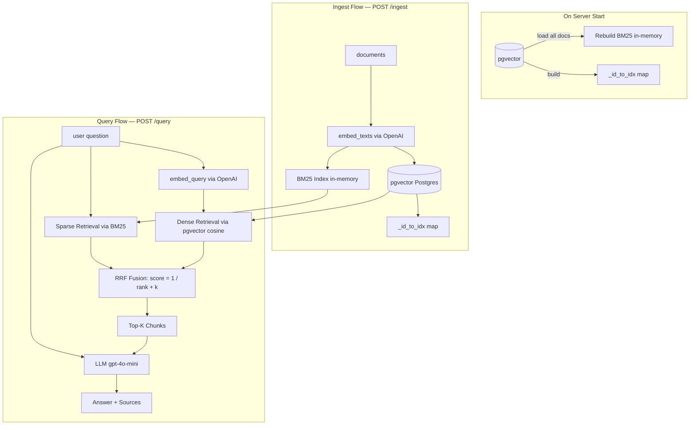

# RAG Pipeline Architecture

## Key design decisions

| Decision | Why |
|----------|-----|
| pgvector for dense storage | Vectors persist across restarts; native cosine similarity via SQL |
| BM25 in-memory | No standard way to persist BM25 state; rebuilt from DB on startup |
| RRF instead of score averaging | BM25 and cosine scores are on different scales; RRF uses rank position only |
| `top_k * 2` in each retrieval step | Cast a wide net before fusing — gives RRF more signal to work with |
| Startup lifespan | Bridges persistent DB and ephemeral in-memory structures after every restart |
